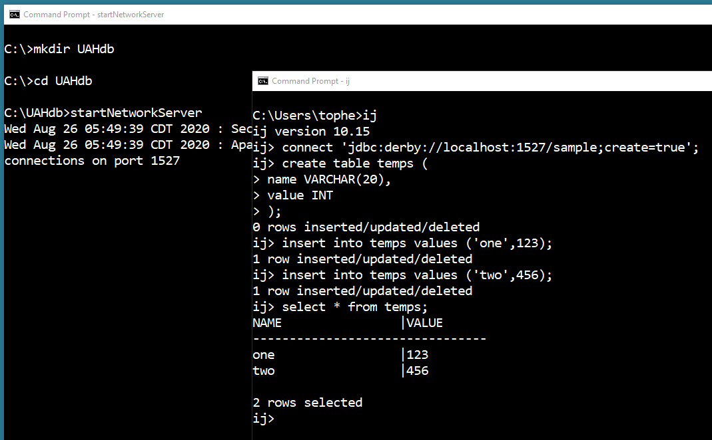
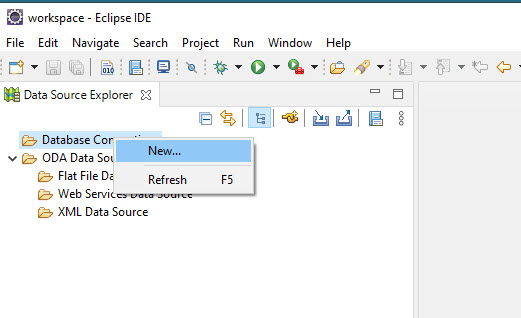
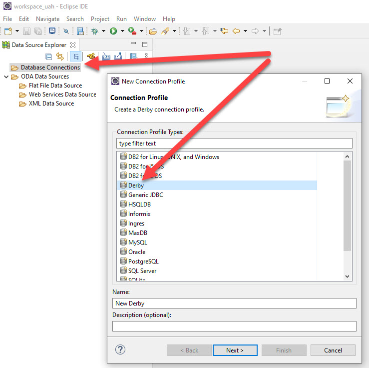
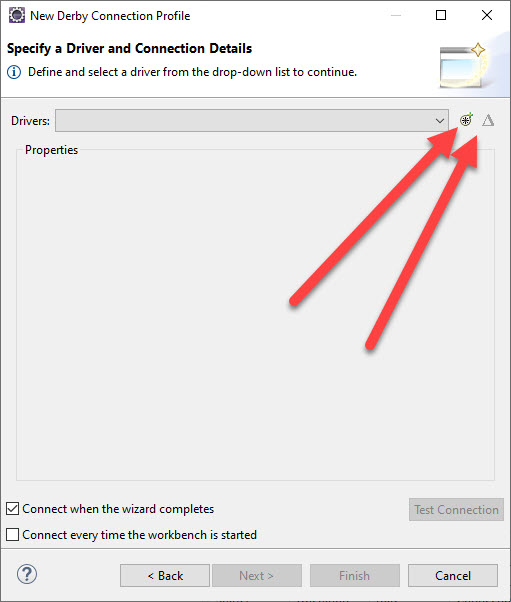
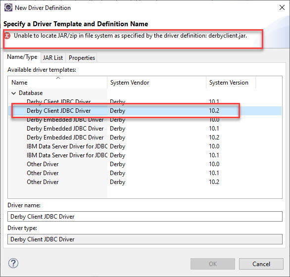
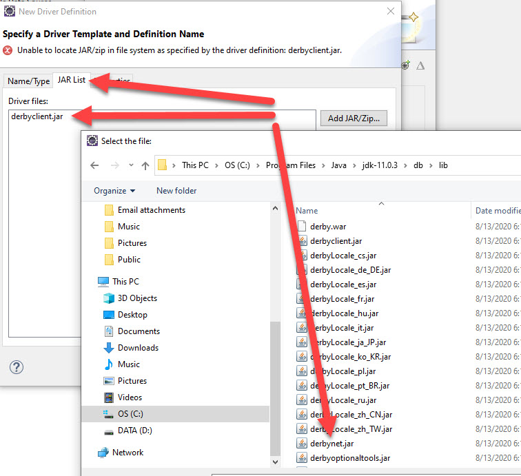
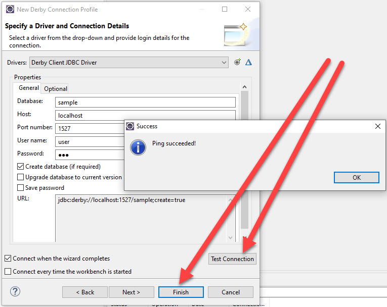
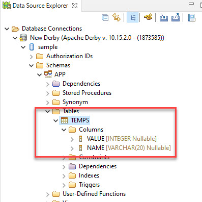

# Working with Derby

First, lets fire up the derby database server. I already have derby/db/bin in my path. I'll
create a new directory for this database, or you can run the "startNetworkServer" script
from your project directory to keep everything together.

Now open a second window and connect to the database with "ij" to make some sample data:

You can close the "ij" window if you want (you can leave it open). But you must leave the window open
with the network server running.

# Using Eclipse's Database Tools

You do not have to use the database editor built into Eclipse. The "ij" command line program
does all the database maintenance we need. But Eclipse does a nice job of visually rendering the data. If
you want to use it, here is how.

## Create a Connection Profile

Open the `Database Development` perspective in Eclipse. Right click on the `Database Connection` folder
on the left side of the panel and select `New...`.

You can pick `Derby` from the profile list. Or you can pick `Generic JDBC`. Either way, you'll still have
some customization to do. I'll pick the `Derby` for this example. The profile contains some default configurations
we won't have to fill in.

Click `Next`

If this is your first time to use the profile, the driver list might be empty. If it is, press the "+" to add a new one.
If there is already a driver, you can edit the details by pressing the triangle.

## Pointing to the Derby Jar

You'll see several derby versions in the list. Pick the latest "Derby Client JDBC Driver". Notice the error message at the
top. The expected JAR file is not installed automatically.

Click on the JAR List tab. You'll see that the template expects there to be a "derbyclient.jar" file, but there isn't one.

Click the "Add JAR/ZIP" button and browse to the "db/lib" directory for derby. You'll see the "derbyclient.jar" there, but 
don't pick that one. Instead, pick the "derbynet.jar" file down the list. Derby must have evolved since the eclipse
profile was created.

Now delete the "derbyclient.jar" from the "Driver files:" list. All you need is the "derbynet.jar".

## Testing the connection

Now put in the database information we just created. We called our database "sample". We are connecting to "localhost" on port "1527". The driver requires a username, but our database isn't configured to check it. Put in anything you like.

Notice the URL shown in the dialog. This is built from the information in the form, and you see it is the same URL we use with "ij". That looks good!

Now click "Test Connection".

If the database server is still running, you should see "Ping succeeded".

## Using the database explorer

Once your connection is made, you can surf the database with the explorer in the left panel.

